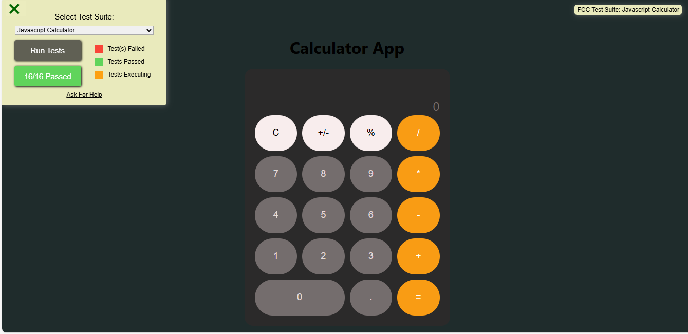
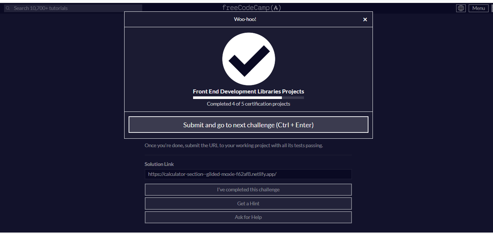

# Calculator Project 🚀🚀

## Description 📝
This project is a web-based calculator built using React. The calculator supports basic arithmetic operations and handles various edge cases, ensuring a smooth and intuitive user experience. The project fulfills the user stories required to pass all tests, and it uses formula logic to evaluate expressions, maintaining the order of operations.

## Demo 📸

 
 [Live-link](https://calculator-section--gilded-moxie-f62af8.netlify.app/)

## Features ⭐
- Basic arithmetic operations: addition, subtraction, multiplication, and division.
- Supports input of decimal numbers.
- Handles consecutive operator inputs by using the last entered operator.
- Clears the display with a single button click.
- Displays the result of the computation when the equals button is pressed.
- Precision handling for operations resulting in decimal values.
- User-friendly and accessible design.

## Technologies Used 🛠️
- React js 
- HTML, CSS, and JavaScript

## How to Run the Project
1. Clone the repository to your local machine.
2. Install the dependencies by running `npm install` or `yarn install`.
3. Start the development server by running `npm start` or `yarn start`.
4. Open your web browser and navigate to `http://localhost:3000` to view the Markdown previewer.

## Testing
All the required user stories and tests have been successfully completed and passed.

## Acknowledgments 📝
This project was built as part of the FreeCodeCamp curriculum. The project requirements and the provided Calculator application example were sourced from the FreeCodeCamp website.

## Author 👩‍💻
- LinkedIn: [Mehria saqibi](https://www.linkedin.com/in/mehria-saqibi-a386a41a1?utm_source=share&utm_campaign=share_via&utm_content=profile&utm_medium=android_app)
- Email: [email](mosawermh@gmail.com)

## Contributing 🤝

Contributions are welcome! If you'd like to contribute, please fork the repository and create a pull request. Ensure that your code follows the project's coding standards and guidelines.